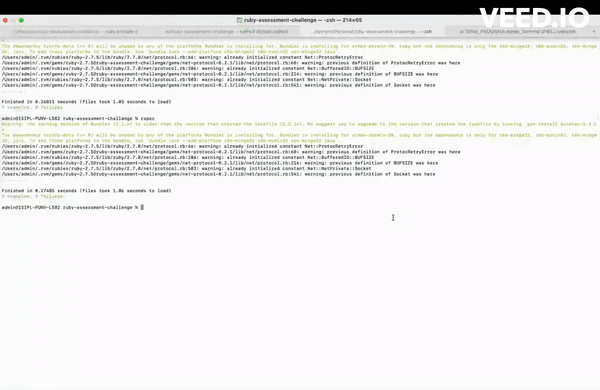

# Assessment Test: User, Program, and Enrollment Management System

## Introduction

This application serves as a management system for users, programs, and enrollments, allowing for the tracking of students, teachers, and their respective programs.

This README provides an overview of the project, but you can find more detailed documentation in the [project's wiki](https://github.com/rah00l/ruby-assessment-challenge/wiki)

### Objectives

- Manage Users: Users can be students, teachers, or both (student_teacher).
- Manage Programs: Represents the subjects of courses.
- Manage Enrollments: Associate users (students and teachers) with programs.

## Live Demo

<a href="https://github.com/rah00l/ruby-assessment-challenge"></a>

### Getting Started

1. **Cloning the Repository**: Clone the repository to your local machine:

   ```
   git clone https://github.com/rah00l/ruby-assessment-challenge.git
   ```

2. **Install Dependencies**: Install the necessary dependencies using Bundler:

   ```
   bundle install
   ```

3. **Database Setup**: Run database migrations to set up the database schema:

   ```
   rails db:migrate
   ```

4. **Run the Application**: Start the Rails server:

   ```
   rails server
   ```

### Features

- **User Management**: Create, update, and delete users. Users can be students, teachers, or both.
- **Program Management**: Add, edit, and remove programs representing different courses.
- **Enrollment Management**: Enroll students and teachers in programs.

### Usage

#### User Management

- **Create User**: Add a new user with a name, age, and role (student, teacher, or both).
- **Edit User**: Modify user details, including name, age, and role.
- **Delete User**: Remove a user from the system.

#### Program Management

- **Add Program**: Create a new program with a name and description.
- **Edit Program**: Modify program details, including name and description.
- **Delete Program**: Remove a program from the system.

#### Enrollment Management

- **Enroll User**: Associate a user (student or teacher) with a program.
- **Unenroll User**: Remove a user from a program.

## Testing

The application includes a suite of RSpec tests to ensure the reliability and functionality of the system. Run the tests using the following command:

```
rspec
```
